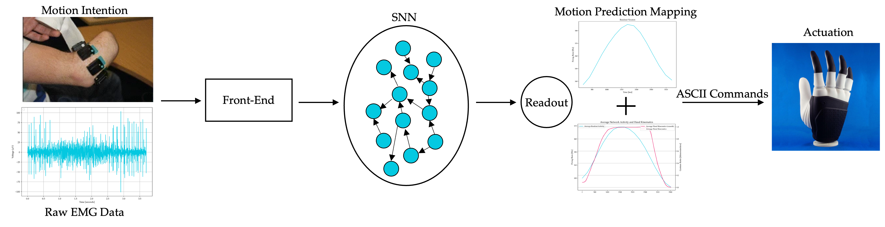

# SNN-hand-kinematics-estimation-from-sEMG-signals

Master Thesis: spiking neural network for estimating hand kinematics from sEMG signals. This scheme could allow more intuitive control of hand prostheses. An end-to-end processing pipeline centered around a neuromorphic reservoir network is proposed as a potentially efficient, robust and user-intuitive approach to proportional myocontrol.

The structure of this repository can be summarized as follows:

- Load_Data.py loads EMG and hand kinematics data from a public database (NinaPro).
- SNN_fron_end.py performs the front-end processing on the raw data.
- PCA_main.py (supported by PCA.py) is used to run an offline PCA analysis on the data to identify most improtant EMG electrode channels.
- Brian_Input.py converts the time-series signal at the end of the front-end into spiking inputs into the main spiking reservoir network.
- Random_Network.py builds a spiking reservoir network, takes the outputs of the previous processing phases as stimulating inputs and contains all functions necessary to simulate the behaviour/activity of the network.
- Random_Network_tune.py can be used to more easily manually tune and try out different parameters of the network which can then be copied to the main net in & Random_Network.py.
- Random_Network_Analyze.py is used to run the simulations of Random_Network.py analyze the activity of the network to draw conclusions.
- Support_Functions.py holds the support functions for all processes as well as many plotting methods.
